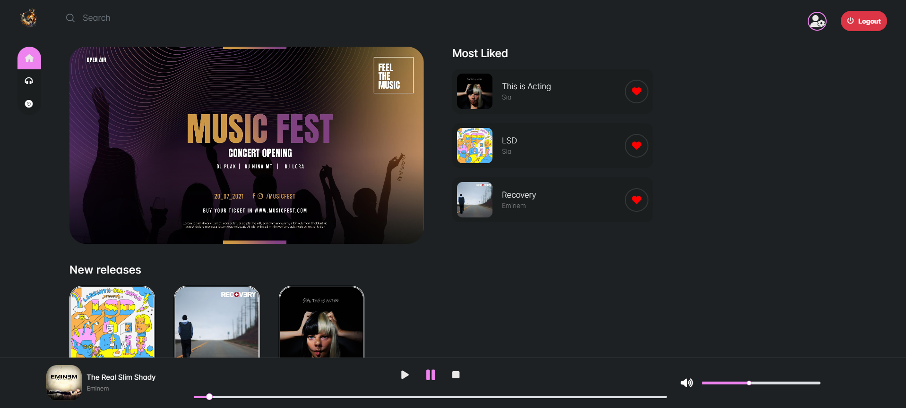
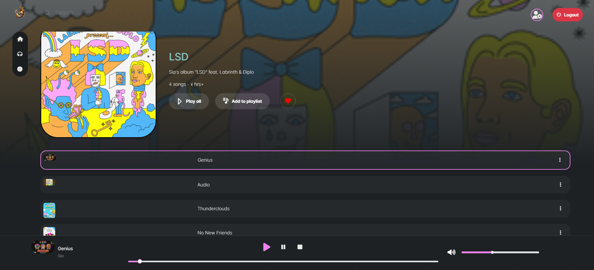

# SONET - Audio Streaming Platform

SONET is an Audio Streaming platform developed using Spring Boot, Spring Security, Spring Data JPA, JWT, Role-based authentication & authorization, Angular. User can either register as Artist OR Listener.

 

## Features

- **User Authentication and Authorization:**
  - Utilizes Spring Security for secure user authentication.
  - Implements role-based access control using JSON Web Tokens (JWT).

- **Admin Dashboard:**
  - Admin dashboard to manage users, their authorities & roles

- **Artist Functionality:**
  - Artists can create albums, add songs to albums, and publish their work.
  - Role-based access ensures that only authorized artists can perform these actions.

- **Listener Experience:**
  - Users can discover and listen to albums and songs.
  - Provides an intuitive interface for users to like and express their appreciation for songs.

- **Clean and Appealing UI Experience:**
  - Delivers a visually appealing and user-friendly interface for an enhanced streaming experience.

## Technologies Used

- **Backend:**
  - Spring Boot
  - Spring Security
  - Spring Data JPA
  - JSON Web Tokens (JWT)

- **Frontend:**
  - Angular
  - PrimeNG
  - Scss for styling

- **Database:**
  - MySQL
